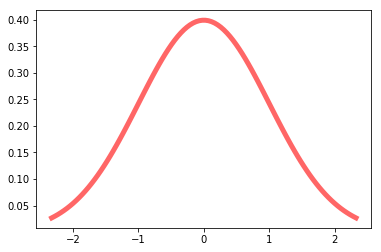

### Plotting a Normal Curve


```python
from scipy.stats import norm
import matplotlib.pyplot as plt
%matplotlib inline
```


```python
def plot_normal(mu,sigma):
  f,ax=plt.subplots()
  x=np.linspace(norm.ppf(0.01,mu,sigma),norm.ppf(0.99,mu,sigma),100)
  ax.plot(x, norm.pdf(x,mu,sigma), 'r-', lw=5, alpha=0.6, label='norm pdf')
  return ax
```


```python
plot_normal(0,1)
```


    <matplotlib.axes._subplots.AxesSubplot at 0x1bca95a2320>




